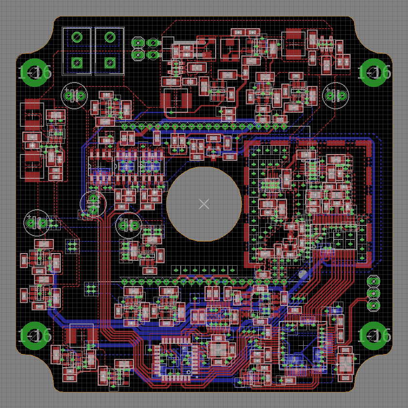

This is the first version of this camera and had a few small design issues, these will be fixed in v2.

# openlux

openlux is an open source design for an astrophotography camera designed around the KAI-11002 CCD sensor.

### Hardware specifications

* KAI-11002 CCD sensor
  * 4008x2672 resolution
  * 43.3mm diagonal size
  * 9um pixels
  * Interline transfer
  * Electronic shutter

* AD9826 ADC
  * Correlated double sampling
  * 16-bit

* ATmega328P + FT2232H
  * High speed USB 2.0 (480Mb/s)

### Sample photo

### PCB render

### Photos

